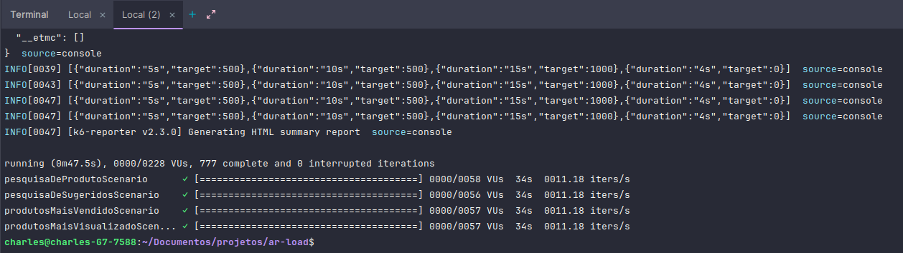
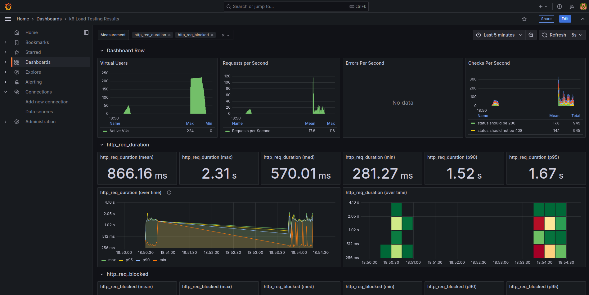
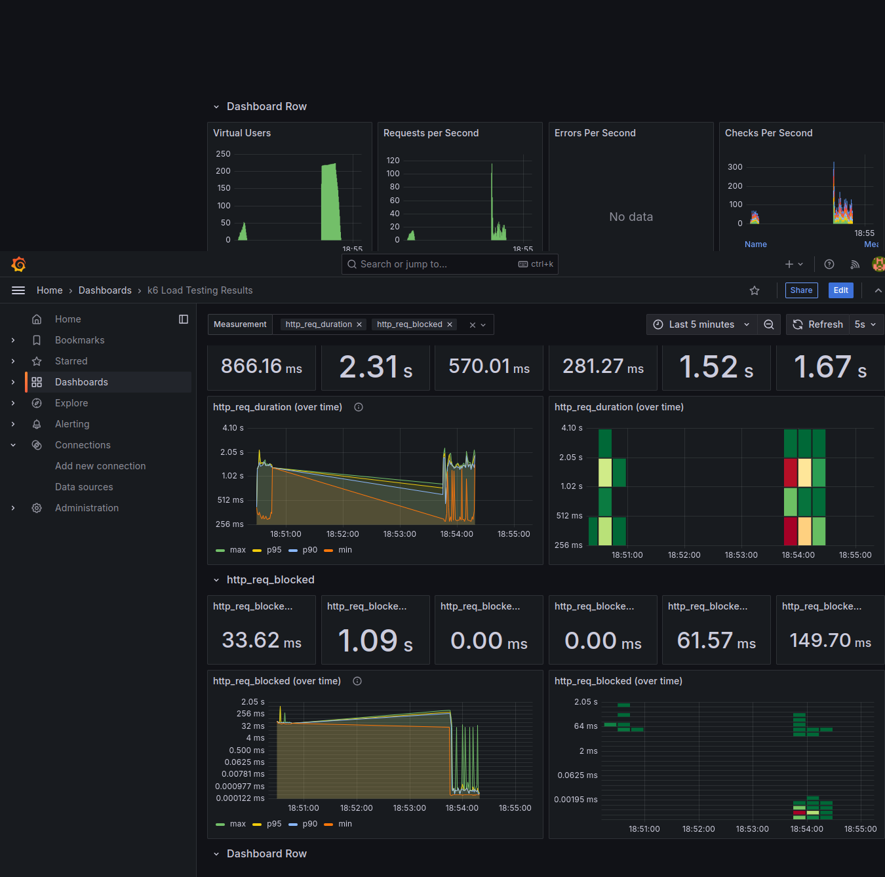
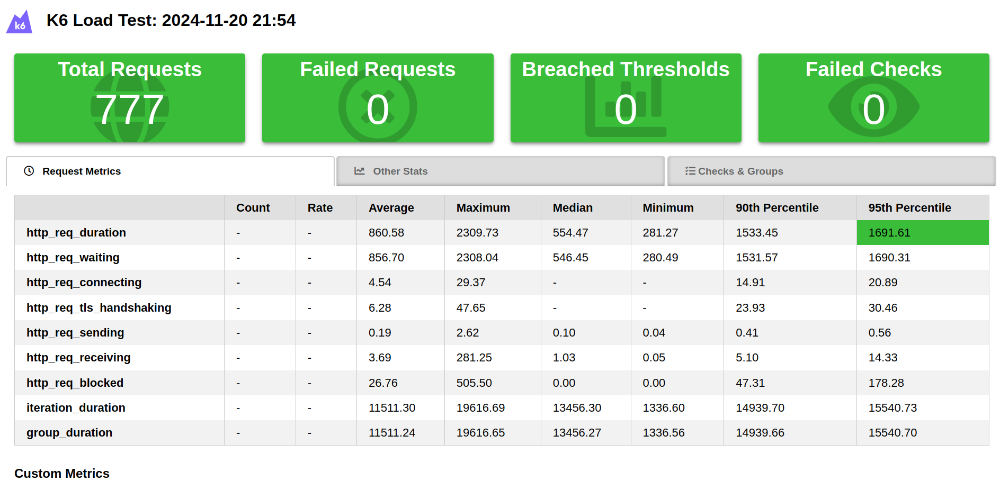

# k6

[Documentação](https://grafana.com/docs/k6/latest/get-started/running-k6/)

Run

```
k6 run main.js
```

Principais métricas

```
data_received
data_sent
http_req_duration (máximo 2 segundos)
http_req_failed
iterations
vus
```

Run com quantidade de VUS e duração, será executado 10 usuários simultâneos durante 30 segundos

```
k6 run --vus 10 --duration 30s main.js
```

Run com quantidade de VUS e iterações, será executado 10 usuários simultâneos durante 100 iterações

```
k6 run --vus 10 --iterations 100 main.js
```

Executar estágios de testes paralelos, basta inserir a duration e target separados por objetos dentro da lista

```
k6 run main.js --env STAGES_SET='[{"duration":"5s","target":10},{"duration":"10s","target":10},{"duration":"5s","target":0}]'
```

Executar com grafana

```
k6 run main.js --out influxdb=http://localhost:8086/k6
```

## Docker compose

```
docker-compose -f Docker/docker-compose.yml up
```

## Acesso ao grafana

```
http://localhost:3000/
```

Acesso: admin

Password: admin

## Acesso ao influx

```
docker ps
docker exec -it a8dda64dcd7f influx
show databases
create database test
```

## Modelo de dashboard
https://grafana.com/grafana/dashboards/2587-k6-load-testing-results/

## Relatório Grafana







